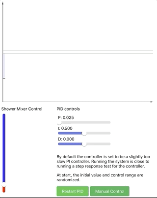

# Shower Mixer Simulator

> An interactive demo exploring the effects of delay in feedback systems

This project was inspired by the shower mixer example in [The Fifth Discipline](https://en.wikipedia.org/wiki/The_Fifth_Discipline) by Peter Senge. It allows exploring the shower example both manually and with a PID controller.

In addition, this my my toy project for learning basics of React and relearn some JavaScript.

Live demo available [online](https://mcdevon.github.io/shower-mixer).

This project was bootstrapped with [Create React App](https://github.com/facebook/create-react-app).

## Preview

## Getting Started

To install the app, run:

#### `npm install`

In the project directory, you can run:

#### `npm start`

Runs the app in the development mode. 
Open [http://localhost:3000](http://localhost:3000) to view it in the browser.

The page will reload if you make edits. 
You will also see any lint errors in the console.

#### `npm run build`

Builds the app for production to the `build` folder. 
It correctly bundles React in production mode and optimizes the build for the best performance.

The build is minified and the filenames include the hashes. 
Your app is ready to be deployed!

#### `npm run deploy`

Builds the app for production and deploys it to Gihub Pages.

## Features

The following features are implemented:

- Delay and smoothing of the output
- Graph to visualize the output
- PID controller as an alternative control scheme
- Tuning sliders for the PID controller
- Display of completion time

## Issues and missing features

Known issues:

- Does not work well on mobile
- The layout takes too much space vertically
- Smoothing does not work in all cases
- PID controls are arbitrarily clamped
- Quick-n-dirty hacks to make simulation running
- Most likely a lot of non-idiomatic code

Missing features:

- Live view of PID controller internal values
- Mode with continuously changing target

## Contributing

As this is mainly a toy and learning project, my responses to any raised issues may be slow. In any case, you are welcome to [open an issue](https://github.com/McDevon/shower-mixer/issues/new) to write down any thoughts you may have on the project.

If you'd like to contribute, please fork the repository and make changes as you'd like. Pull requests are warmly welcome.

## Licensing

This project is licensed under the MIT license.
